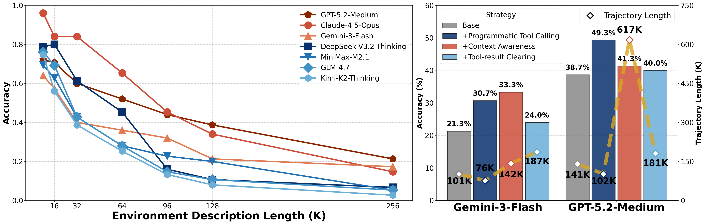
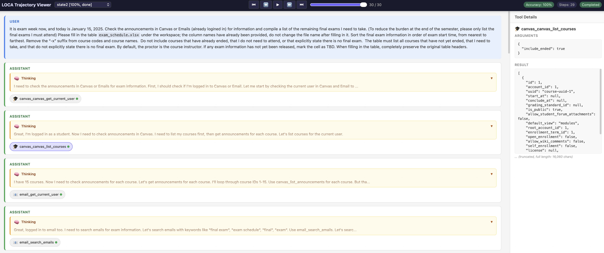

<div align="center">

# LOCA-bench: Benchmarking Language Agents Under Controllable and Extreme Context Growth

[](http://arxiv.org/pdf/2602.07962)
[](LICENSE)

</div>

## Overview

**LOCA-bench** (a benchmark to assess Long-Context Abilities of Agents) is designed to evaluate language agents under extreme and controllable context growth scenarios. Given a task prompt, LOCA-bench leverages automated and scalable control of environment states to regulate the agent's context length.

### Key Highlights

- **Controllable Context Growth**: Extend context length to arbitrary sizes while keeping task semantics fixed
- **Comprehensive Evaluation**: Evaluate language agents as a combination of models and scaffolds
- **Multiple Strategies**: Support various context management strategies for comparison

<div align="center">

</div>

---

## Table of Contents

- [Installation](#installation)
- [Quick Start](#quick-start)
- [Context Management Strategies](#context-management-strategies)
- [Output Structure](#output-structure)
- [Trajectory Visualization](#trajectory-visualization)
- [Evaluate with Claude Code and Anthropic Official API Endpoints](#evaluate-with-claude-code-and-anthropic-official-api-endpoints)
- [Features](#features)
  - [Mock MCP Servers](#mock-mcp-servers)
  - [Adjustable Environment](#adjustable-environment)
  - [Environment Description Length](#environment-description-length)
- [TODO](#todo)
- [Citation](#citation)

---

## Installation

Our implementation is based on [GEM](https://github.com/axon-rl/gem). Follow the steps below to set up the environment:

```bash
# Install uv if not already installed
curl -LsSf https://astral.sh/uv/install.sh | sh

# Clone the repository
git clone https://github.com/hkust-nlp/LOCA-bench.git
cd LOCA-bench

# Create virtual environment and install dependencies
uv venv --python 3.10
source .venv/bin/activate  # On Windows: .venv\Scripts\activate

# Install dependencies
bash install.sh
```

---

## Quick Start

### 1. Set Up API Credentials

Our default evaluation requires an OPENAI Chat Completion API endpoint set up via environment variables:

```bash
export LOCA_OPENAI_API_KEY=your_key_here
export LOCA_OPENAI_BASE_URL=your_base_url_here
```

### 2. Run Evaluation

Use the `loca` CLI tool:

```bash
loca --help
loca run --help
```

Example commands:
```bash
loca run -c task-configs/final_8k_set_config.json -m deepseek-reasoner --max-context-size 130000
```

Environment configurations are provided under `task-configs/` with preset environment description lengths: **8K, 16K, 32K, 64K, 96K, 128K, and 256K** tokens.

### 3. Sandbox Deployment (Optional)

We also provide a [loca-sandbox](https://github.com/hkust-nlp/LOCA-bench/tree/loca-sandbox) branch in this repository. It is refactored with a server–client framework and sandbox environment support, making it a good starting point for deploying Loca-bench in a production-style framework.

---

## Context Management Strategies

LOCA-bench supports multiple context management strategies:

| Strategy | Description | Additional MCP Server |
|----------|-------------|----------------------|
| `react` (default) | Basic reactive agent framework | None |
| `ptc` | Programmatic Tool Calling - orchestrate tools via code execution | `programmatic_tool_calling` |
| `memory_tool` | Persistent storage and retrieval across conversations | `memory_tool` |

All strategies use the same config files from `task-configs/`. 

### Usage Examples

**Basic ReAct Run:**
```bash
loca run -c task-configs/final_8k_set_config.json
```

**Programmatic Tool Calling (PTC):**
```bash
loca run -s ptc -c task-configs/final_8k_set_config.json
```

**Memory Tool Strategy:**
```bash
loca run -s memory_tool -c task-configs/final_8k_set_config.json
```

**Context Awareness:**
```bash
loca run -c task-configs/final_8k_set_config.json --context-awareness
```

**Tool-Result Clearing:**
```bash
loca run -c task-configs/final_8k_set_config.json \
    --context-reset --reset-size 100000 --reset-ratio 0.5
```

**Thinking-Block Clearing:**
```bash
loca run -c task-configs/final_8k_set_config.json \
    --thinking-reset --reset-size 100000 --keep-thinking 1
```

**List available strategies:**
```bash
loca list-strategies
```

**View all options:**
```bash
loca run --help
```

---

## Output Structure

After `loca run` completes, the output directory is created under `outputs/` with the following layout:

```
outputs/inf_{strategy}_{config}_{model}_{params}_{timestamp}/
├── config_react.json          # Snapshot of the config used for this run
├── results.json               # Aggregated results across all tasks
├── all_trajectories.json      # All trajectories consolidated into one file
└── tasks/
    ├── task_mapping.json      # Maps task names to config IDs and seeds
    ├── ABTestingS2LEnv/
    │   ├── state0/
    │   │   ├── trajectory.json    # Full agent trajectory (messages, events, metrics)
    │   │   ├── eval.json          # Per-state evaluation result (accuracy, steps, feedback)
    │   │   ├── token_stats.json   # Token usage tracking per API call
    │   │   ├── agent_workspace/   # Agent's working directory during the task
    │   │   ├── groundtruth_workspace/  # Ground truth for evaluation
    │   │   ├── files/             # Task-specific data files
    │   │   ├── local_db/          # Local database files for MCP servers
    │   │   └── logs/              # MCP server logs
    │   ├── state1/
    │   ├── ...
    │   └── state4/
    ├── CanvasArrangeExamS2LEnv/
    │   └── ...
    └── ...                        # 15 task types, each with 5 states (seeds)
```

### Key Output Files

| File | Description |
|------|-------------|
| `results.json` | Overall summary (avg accuracy, steps, token usage) and per-task breakdown |
| `all_trajectories.json` | Every trajectory keyed by `TaskName/stateN`, used by the visualization tool |
| `eval.json` | Per-task result: `status`, `accuracy`, `steps`, and evaluation `feedback` |
| `trajectory.json` | Full agent-environment interaction: messages, tool calls, events (resets, trims), and metrics |
| `token_stats.json` | Per-API-call token usage for cost and context growth analysis |

---

## Trajectory Visualization

LOCA-bench includes a web-based trajectory replayer for inspecting agent runs step by step.

### Usage

```bash
python vis_traj/server.py --traj_path /path/to/output_dir/all_trajectories.json --port 8000
```

Then open `http://localhost:8000` in your browser. It will show you visualizations as below:



---

## Evaluate with Claude Code and Anthropic Official API Endpoints

### Set Up Anthropic API Key

```bash
export LOCA_ANTHROPIC_API_KEY=your_key_here
```

Optional: use a custom Anthropic-compatible endpoint:

```bash
export LOCA_ANTHROPIC_BASE_URL=your_base_url_here
# Fallback also supported:
# export ANTHROPIC_BASE_URL=your_base_url_here
```

Optional: choose model for Claude Agent SDK path:

```bash
export ANTHROPIC_MODEL=deepseek-chat
```

You can also pass `--model` to `run-claude-agent` (higher priority than `ANTHROPIC_MODEL`).

### Run with Claude Agent SDK / Claude Code

```bash
loca run-claude-agent -c task-configs/final_8k_set_config.json
```

With custom model:
```bash
loca run-claude-agent -c task-configs/final_8k_set_config.json -m deepseek-chat
```

View all options:
```bash
loca run-claude-agent --help
```

### Run with Claude Official API

```bash
loca run-claude-api -c task-configs/final_8k_set_config.json -m claude-sonnet-4-5
```

With extended thinking and programmatic tool calling:
```bash
loca run-claude-api -c task-configs/final_8k_set_config.json \
    --enable-programmatic-tool-calling --enable-thinking
```

View all options:
```bash
loca run-claude-api --help
```

---

## Features

### Mock MCP Servers

LOCA-bench uses local, database-backed mock servers to simulate remote service backends. This approach avoids challenges associated with real online services (authentication, concurrency limits, API changes).

**Location:** [`mcp_convert/`](mcp_convert/)

**Supported Services:**
- Google Calendar
- Canvas LMS
- Email
- BigQuery
- Google Sheets
- Snowflake
- WooCommerce

**Key Properties:**
- Identical tool interfaces to original services
- Request schema and return formats match real APIs
- No authentication required
- Transparent and controllable backend for data injection and environment manipulation

---

### Adjustable Environment

**Location:** [`gem/envs/`](gem/envs/)

Each task uses hand-written templates representing possible environment states, combined with custom generators that assemble these templates into concrete states based on configuration.

**Example:** A task requiring an agent to compile exam information from Canvas and Emails can:
- Instantiate any number of courses and exams
- Control how information is distributed between sources
- Introduce exceptions (exempt courses, courses without exams)
- Add distracting content

By adjusting configuration parameters, environment states with varying scale, difficulty, and distraction levels are automatically generated.

---

### Environment Description Length

Environment complexity is quantified by the number of tokens required to encode the environment's information.

**Measurement Process:**
1. Run scripted tool calls
2. Collect and concatenate all tool outputs an agent would need to read
3. Tokenize the aggregated text using GPT-4's tokenizer

**Preset Configurations:** [`task-configs/`](task-configs/)

| Configuration File | Environment Description Length |
|--------------------|-------------------------------|
| `final_8k_set_config.json` | 8K tokens |
| `final_16k_set_config.json` | 16K tokens |
| `final_32k_set_config.json` | 32K tokens |
| `final_64k_set_config.json` | 64K tokens |
| `final_96k_set_config.json` | 96K tokens |
| `final_128k_set_config.json` | 128K tokens |


---

## Acknowledgement
We appreciate [gem](https://github.com/axon-rl/gem) to open-source a nice agentic LLM framework, based on which we build LOCA-bench.

---

## Citation

If you find LOCA-bench useful in your research, please cite our paper:

```bibtex
@article{loca-bench2026,
  title   = {LOCA-bench: Benchmarking Language Agents Under Controllable and Extreme Context Growth},
  author  = {Zeng, Weihao and Huang, Yuzhen and He, Junxian},
  journal = {arXiv preprint arXiv:2602.07962},
  year    = {2026}
}
```
